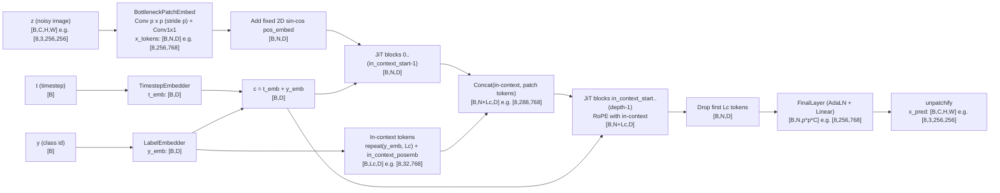

# JiT Data Flow Diagram

Example shown for `JiT-B/16`, `img_size=256`, `B=8`.

## Terms

- `B`: batch size.
- `C`: image channels (`3` for RGB).
- `H, W`: image height and width.
- `p`: patch size (`16` or `32`).
- `N`: number of patches, `N = (H/p) * (W/p)`.
- `D`: token hidden size (`768` for B, `1024` for L, `1280` for H variants).
- `Lc`: in-context token count (`in_context_len`, usually `32`).
- `depth`: number of transformer blocks.
- `z`: noisy input image to JiT.
- `t`: diffusion timestep per sample.
- `y`: class label id.
- `t_emb`: timestep embedding vector.
- `y_emb`: class embedding vector.
- `c`: conditioning vector used by all JiT blocks (`c = t_emb + y_emb`).
- `pos_embed`: fixed 2D sine-cosine positional embedding for patch tokens.
- `in_context_posemb`: learned positional embedding for in-context tokens.
- `RoPE`: rotary positional embedding used inside attention.
- `JiT block`: transformer block (attention + SwiGLU MLP) with AdaLN modulation from `c`.
- `AdaLN`: adaptive LayerNorm style modulation (shift/scale/gates generated from `c`).
- `FinalLayer`: final AdaLN + linear projection from token features to patch pixels.
- `unpatchify`: reshapes patch outputs back to full image tensor.
- `x_pred`: predicted denoised image at current step.

## How To Render

1. In Markdown, keep the diagram inside a fenced `mermaid` code block.
2. Mermaid Live Editor: https://mermaid.live
3. VS Code: install a Mermaid Markdown preview extension, then open preview.
4. CLI render:
   - `npm i -g @mermaid-js/mermaid-cli`
   - `mmdc -i JiT/jit_dataflow.mmd -o JiT/jit_dataflow.svg`
